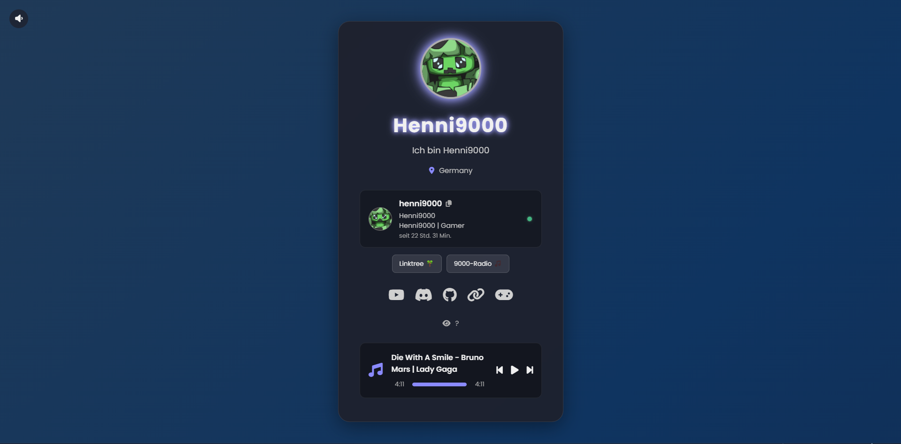

# henni-profile

Meine Profil Website 🚀 - Eine dynamische persönliche Profilseite, die Live-Discord-Status, Musikwiedergabe und mehr integriert.


<!-- Füge oben einen Screenshot oder ein GIF deiner Website ein und verlinke es ggf. zur Live-Demo -->

## ✨ Features

*   **Dynamisches Profil:** Zeigt Benutzerinformationen wie Namen und eine kurze Bio an.
*   **Live Discord Status:**
    *   Ruft den aktuellen Discord-Status (Online, Idle, DND, Offline) über die [Lanyard API](https://lanyard.rest/) ab.
    *   Zeigt die aktuelle Aktivität (Spielen, Streamen, Musikhören, Custom Status) inklusive Details, Status und Dauer an.
    *   Zeigt klickbare Buttons aus der Discord Rich Presence an (falls vorhanden).
    *   Aktualisiert sich automatisch alle 30 Sekunden.
*   **Discord PFP als Favicon:** Setzt das Browser-Favicon dynamisch auf das aktuelle Discord-Profilbild.
*   **Interaktiver Musikplayer:**
    *   Spielt eine lokale MP3-Datei (`song.mp3`).
    *   Zeigt Songtitel und Interpret an.
    *   Bietet Play/Pause-Steuerung.
    *   Zeigt aktuelle Wiedergabezeit und Gesamtdauer an.
    *   Interaktiver Fortschrittsbalken zum Springen im Song (Seeking).
*   **Lautstärkeregler:**
    *   Schwebender Regler oben links.
    *   Fährt beim Hovern aus.
    *   Ermöglicht die Anpassung der Lautstärke.
    *   Mute-Funktion durch Klick auf das Icon.
*   **Benutzerfreundlichkeit:**
    *   Kopier-Button für den Discord-Benutzernamen.
    *   Verlinkungen zu sozialen Profilen (YouTube, Discord, GitHub) und benutzerdefinierten Projekten.
*   **Visuelle Effekte:**
    *   Ladeanimation beim Start.
    *   Sanfte Einblend-Animation für die Profilkarte und ihre Elemente.
    *   Pulsierende Statusanzeige (Online/DND).
    *   Hover-Effekte für interaktive Elemente.
    *   Optionaler Bildhintergrund mit Fallback auf einen animierten Gradienten.

## 🚀 Live Demo

<!-- Füge hier den Link zu deiner Live-Website ein, z.B. auf Netlify oder GitHub Pages -->
[**Hier klicken zur Live-Demo**](https://henni9000.info.moinmeister3751.de/)

## 🛠️ Verwendete Technologien

*   **HTML5:** Struktur der Webseite.
*   **CSS3:** Styling, Layout (Flexbox), Animationen und Effekte.
*   **JavaScript (Vanilla):**
    *   DOM-Manipulation.
    *   API-Anfragen (Fetch API) an Lanyard.
    *   Steuerung des Audio-Players.
    *   Event-Handling für Interaktionen.
    *   Dynamische Hintergrundauswahl.
*   **[Lanyard API](https://lanyard.rest/):** Zum Abrufen des Live-Discord-Status.
*   **[Font Awesome](https://fontawesome.com/):** Für Icons.
*   **[Google Fonts](https://fonts.google.com/):** Für die Schriftart "Poppins".

## ⚙️ Setup und lokale Ausführung

1.  **Repository klonen:**
    ```bash
    git clone https://github.com/Henni9000/henni-profile.git
    cd henni-profile
    ```
2.  **Musikdatei hinzufügen:** Platziere deine gewünschte Musikdatei als `song.mp3` im Hauptverzeichnis des Projekts.
3.  **Hintergrundbild hinzufügen (Optional):** Platziere dein gewünschtes Hintergrundbild als `background.jpg` im Hauptverzeichnis. Wenn kein Bild gefunden wird, wird der animierte Gradient verwendet.
4.  **Lokalen Webserver starten:** Da die Seite API-Anfragen (Lanyard) durchführt und lokale Audiodateien lädt, funktioniert sie am besten über einen lokalen Webserver. Das direkte Öffnen der `index.html` als `file://` kann zu Problemen führen (CORS, Audio-Berechtigungen).
    *   **Option 1: VS Code Live Server:** Wenn du Visual Studio Code verwendest, installiere die "Live Server"-Erweiterung und klicke unten rechts auf "Go Live".
    *   **Option 2: Python:** Wenn du Python installiert hast, führe im Projektverzeichnis aus:
        ```bash
        # Python 3
        python -m http.server
        # Python 2
        python -m SimpleHTTPServer
        ```
        Öffne dann `http://localhost:8000` (oder den angezeigten Port) im Browser.
    *   **Option 3: Node.js http-server:** Wenn du Node.js installiert hast:
        ```bash
        npm install -g http-server
        http-server .
        ```
        Öffne dann den angezeigten Link (z.B. `http://localhost:8080`) im Browser.
5.  **Öffnen:** Greife über die vom lokalen Server bereitgestellte URL (z.B. `http://localhost:8000`) auf die Seite zu.

## 🔧 Anpassung

*   **Discord User ID:** Ändere die ID in der `apiUrl`-Variable in `script.js`, um den Status eines anderen Benutzers anzuzeigen.
*   **Soziale Links:** Bearbeite die `<a>`-Tags im `<div class="social-links">`-Abschnitt in `index.html`.
*   **Songtitel:** Ändere den Text im `<span class="song-title">`-Element in `index.html`, um ihn an deine `song.mp3` anzupassen.

## 📄 Lizenz

<!-- Wähle eine Lizenz, z.B. MIT. Füge einen Link zur Lizenzdatei hinzu, wenn du eine erstellst -->
Dieses Projekt steht unter der [MIT-Lizenz](LICENSE).

---

Viel Spaß mit deiner Profilseite!
